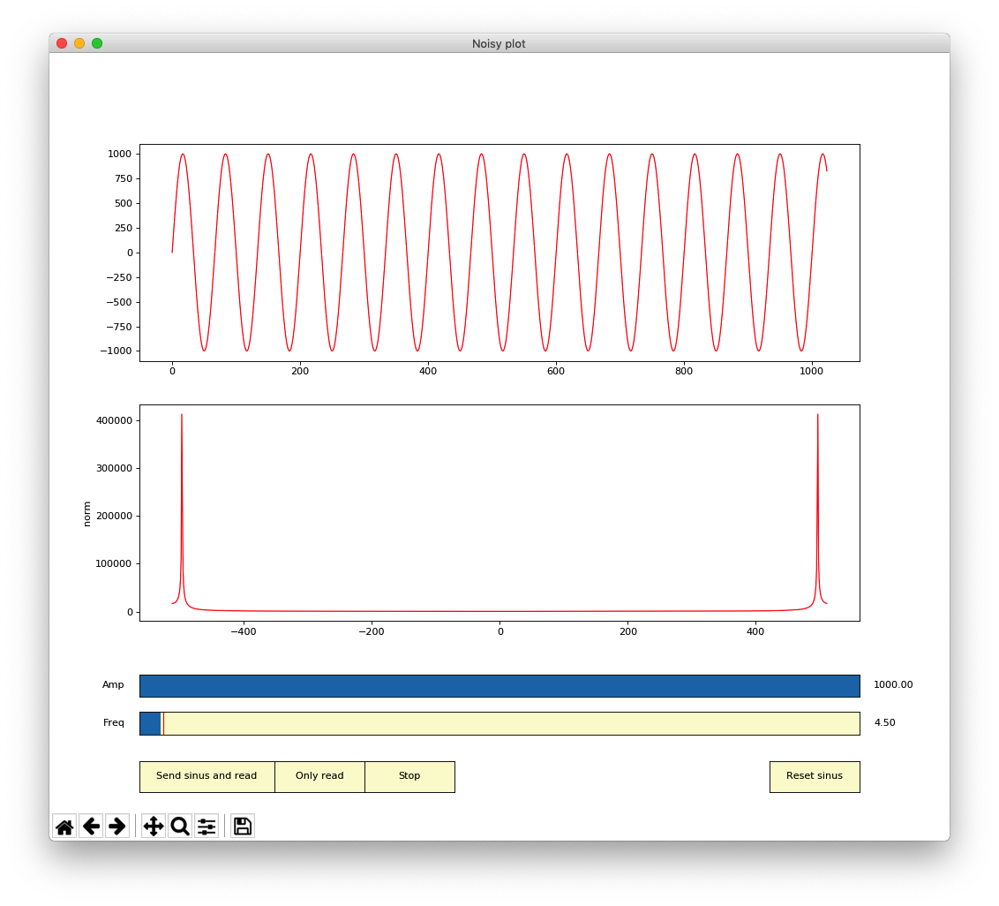
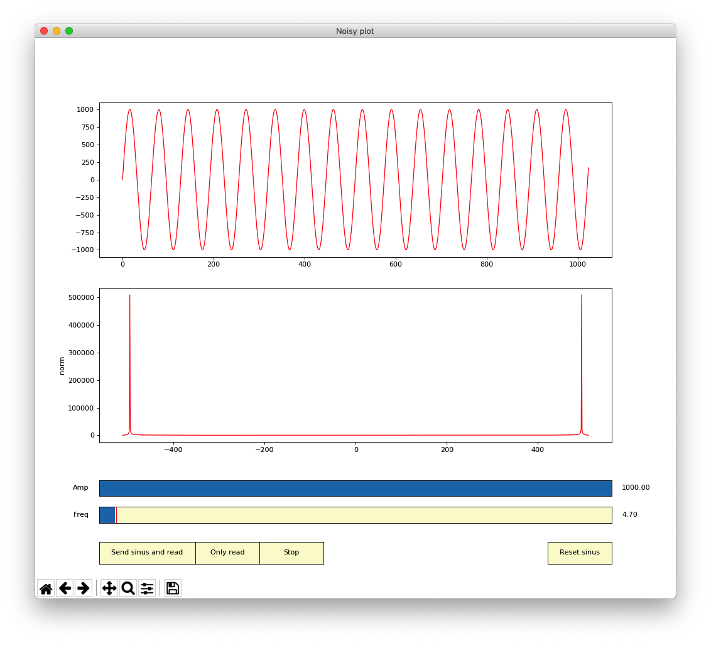

# Task 1: Result of the FFT
- The result of the FFT gives you 2 symmetrical peaks on the plot
- You can see that increasing the frequency with the slider moves the peaks toward the center of the plot
- Thus the position of the peaks directly gives you the frequency present in the signal, 150Hz putting the peaks on the center of the plot and 0Hz putting them on the borders
- Therefore for better visualization, the zero is placed on the center of the plot
---
- Then by knowing that the sampling frequency of the signal sent by the script is 300Hz, we can assume the maximum frequency we can detect correctly with the FFT is half of the sampling frequency of the signal
- This is exactly what says the Shannon/Nyquist theorem, which says we need to have a sampling frequency at least twice bigger as the maximum frequency we want to detect
---
- By looking at the Fourier Transform of a sinusoidal signal, we can see we obtain two peaks:
    - One for the positive frequency
    - One for the negative ([equation 1](#equation-1))
    - This why we have two symmetrical peaks on the plot

>### Equation 1
> $Tf(sin(2\pi \nu_0 t))=\int\limits_{-\infty}^{+\infty}sin(2\pi \nu_0 t)e^{-i2\pi \nu t}dt=\frac{1}{2i}\bigg(\delta (\nu -\nu_0 )-\delta (\nu +\nu_0 )\bigg)$

# Task 2: Position of the frequencies in the FFT result
- With the previous answer, we can deduce the relation between the position of the peaks and the frequency they represent
- As 150Hz gives a position 0 and 0Hz gives a position of -512 and 512, we find :

>### Equation 2
>$frequency = 150 - abs(position) * \frac{150}{512}$

- So if two peaks are positioned at -200 and 200, it means we have a frequency of about 91,4Hz

## Bonus part
- The Fourier Transform assumes we have complete periods of the signal we want to process but we don't obtain perfect Dirac because we don't necessarily have the full periods of the signal
- For example these are the plots we obtain with a frequency of 4.5 Hz and 4.7 Hz:

>### Figure 1
>Python plots with a frequency of 4.5Hz
    <p float="left">
    
    </p>

>### Figure 2
>Python plots with a frequency of 4.7Hz
    <p float="left">
    
    </p>

- As we can see the peaks with 4.7Hz are more defined than with 4.5Hz
- We can also see that we clearly don't get complete periods with 4.5Hz in this example
- The fact we don't have complete periods introduces some parasitic frequencies around the correct frequency

# Task 3: Understanding of the code
- **\#ifdef**, **\#else** and **\#endif** are preprocessor directives
- They are evaluated by the compiler and not during the execution of the code
- The main difference with using standard **if...else** condition is that the code inside theses directives is included or excluded from the final compiled code
- **\#ifdef** means if defined
---
- In the code of this TP, the functions inside the condition are included in the code only if
    - **SEND\_FROM\_MIC** is defined, the same happens with **DOUBLE\_BUFFERING**
    - It's like having several versions of a code simultaneously but only one is taken into account by the compiler
- ChibiOs uses this technique to include or not parts of its code depending on the configuration in the file **mcuconf.h** for example
- Note that even if we usually don't indent the directives, the levels are preserved
    - It means in our case that even if **DOUBLE\_BUFFERING** is defined, the code concerned won't be present if **SEND\_FROM\_MIC** is not defined
---
- The buffers used for the FFT are located in the file **audio\_processing.c**
- The input buffers are of size 2***FFT\_SIZE** and contain complex numbers
- The data are arranged like [real0, imag0, real1, imag1, etc...]
- The output buffers are located in the same file and are of size **FFT\_SIZE**
- They are simple arrays without specific arrangement
- The fact that they use float numbers means that each number is coded in 32bits
    - This leads to a size of 2 * **FFT\_SIZE** * 4 = 8192 bytes for the input buffers and a size **FFT\_SIZE** * 4 = 4096 bytes for each output buffer
---
- The function **arm\_cmplx\_mag\_f32()** is used to compute the magnitude (aka the norm) of complex numbers in float format
- We need it in order to only send to the python script the norms of the complex numbers we get with the FFT as it is far easier to analyze and visualize

# Task 4: FFT implementations
- By looking at the description of the two FFT implementations, we can see both of them process the data In-Place
- This simply means the results are put in the same buffer as the input
- So here, once an input buffer has been processed in one of the FFT functions, the buffer will contain the result of the FFT and no more the analog data
- Thus we cannot use two FFT with the same buffer. This allows us to not use more space to store the results
- Space is always a precious thing in the world of the microcontrollers
---
- To use the non optimized FFT function, we need to convert the float array into a **complex\_float** array needed by the function
- This can be done by using a loop to copy data from the input buffer to a new **complex\_float** buffer and use it with the non optimized FFT
- Then we need to reconvert the data in order to have again a float array containing complex values
- The declaration of the variable type **complex\_float** is located in the file **fft.h**
- You can see an example of the conversion below :

>### Code block 1
>Using the non optimized function
>```c
>//temp tab used to store values in complex_float format
>//needed bx doFFT_c
>static complex_float temp_tab[FFT_SIZE];
>
>//need to convert the float buffer into complex_float struct array
>for(uint16_t i = 0; i < (2*FFT_SIZE); i += 2) {
>    temp_tab[i/2].real = bufferCmplxInput[i];
>    temp_tab[i/2].imag = bufferCmplxInput[i+1];
>}
>
>//do a non optimized FFT
>doFFT_c(FFT_SIZE, temp_tab);
>
>//reconverts the result into a float buffer
>for(uint16_t i = 0; i < (2*FFT_SIZE); i += 2) {
>    bufferCmplxInput[i] = temp_tab[i/2].real;
>    bufferCmplxInput[i+1] = temp_tab[i/2].imag;
>}
>```
- Then by looking at the result with the python script, we can see the result is exactly the same as with the optimized one

# Task 5: Computational time of the two FFT implementations
- You can see an example of the main function below where we can comment either the use of the optimized FFT or the non optimized FFT
- We measure their execution time and the one of **arm\_cmplx\_mag\_f32()** too
- In the example code below, you can see the non optimized function is used and the other is commented
---
- Pay attention on the declaration of the buffer **temp\_tab** used to store the data in **complex\_float** structure
- It is declared inside the main function with a **static** attribute
- If it were declared inside the main without the static attribute, it would have been stored in the stack of the main thread
- And depending on what is done in this thread, we won't have enough room for this declaration, it may work but not sure
- Offcourse it would be possible to increase the size of the main thread's stack but it's a lot simpler and safer to use the static attribute
- It is also possible to declare it as static outside the main function, but then every functions of the main.c file would be able to use it and it's not necessary in this case


>### Code block 2
>Main function
>```c
>...
>
>int main(void)
>{
>
>    halInit();
>    chSysInit();
>    mpu_init();
>
>    //starts the serial communication
>    serial_start();
>    //starts the USB communication
>    usb_start();
>    //starts timer 12
>    timer12_start();
>    //inits the motors
>    motors_init();
>
>    //temp tab used to store values in complex_float format
>    //needed bx doFFT_c
>    static complex_float temp_tab[FFT_SIZE];
>    //send_tab is used to save the state of the buffer to send (double buffering)
>    //to avoid modifications of the buffer while sending it
>    static float send_tab[FFT_SIZE];
>
>#ifdef SEND_FROM_MIC
>    //starts the microphones processing thread.
>    //it calls the callback given in parameter when samples are ready
>    mic_start(&processAudioData);
>#endif  /* SEND_FROM_MIC */
>
>    /* Infinite loop. */
>    while (1) {
>#ifdef SEND_FROM_MIC
>        //waits until a result must be sent to the computer
>        wait_send_to_computer();
>#ifdef DOUBLE_BUFFERING
>        //we copy the buffer to avoid conflicts
>        arm_copy_f32(get_audio_buffer_ptr(LEFT_OUTPUT), send_tab, FFT_SIZE);
>        SendFloatToComputer((BaseSequentialStream *) &SD3, send_tab, FFT_SIZE);
>#else
>        SendFloatToComputer((BaseSequentialStream *) &SD3, get_audio_buffer_ptr(LEFT_OUTPUT), FFT_SIZE);
>#endif  /* DOUBLE_BUFFERING */
>#else
>        //time measurement variables
>        volatile uint16_t time_fft = 0;
>        volatile uint16_t time_mag  = 0;
>
>        float* bufferCmplxInput = get_audio_buffer_ptr(LEFT_CMPLX_INPUT);
>        float* bufferOutput = get_audio_buffer_ptr(LEFT_OUTPUT);
>
>        uint16_t size = ReceiveInt16FromComputer((BaseSequentialStream *) &SD3, bufferCmplxInput, FFT_SIZE);
>
>        if(size == FFT_SIZE){
>            /*
>            *   Optimized FFT
>            */
>            
>            // chSysLock();
>            // //reset the timer counter
>            // GPTD12.tim->CNT = 0;
>
>            // doFFT_optimized(FFT_SIZE, bufferCmplxInput);
>
>            // time_fft = GPTD12.tim->CNT;
>            // chSysUnlock();
>
>            /*
>            *   End of optimized FFT
>            */
>
>            /*
>            *   Non optimized FFT
>            */
>
>            //need to convert the float buffer into complex_float struct array
>            for(uint16_t i = 0 ; i < (2*FFT_SIZE) ; i+=2){
>                temp_tab[i/2].real = bufferCmplxInput[i];
>                temp_tab[i/2].imag = bufferCmplxInput[i+1];
>            }
>
>            chSysLock();
>            //reset the timer counter
>            GPTD12.tim->CNT = 0;
>
>            //do a non optimized FFT
>            doFFT_c(FFT_SIZE, temp_tab);
>
>            time_fft = GPTD12.tim->CNT;
>            chSysUnlock();
>            
>            //reconverts the result into a float buffer
>            for(uint16_t i = 0 ; i < (2*FFT_SIZE) ; i+=2){
>                bufferCmplxInput[i] = temp_tab[i/2].real;
>                bufferCmplxInput[i+1] = temp_tab[i/2].imag;
>            }
>
>            /*
>            *   End of non optimized FFT
>            */
>
>            chSysLock();
>            //reset the timer counter
>            GPTD12.tim->CNT = 0;
>
>            arm_cmplx_mag_f32(bufferCmplxInput, bufferOutput, FFT_SIZE);
>
>            time_mag = GPTD12.tim->CNT;
>            chSysUnlock();
>
>            SendFloatToComputer((BaseSequentialStream *) &SD3, bufferOutput, FFT_SIZE);
>            chprintf((BaseSequentialStream *) &SDU1, "time fft = %d us, time magnitude = %d us\n",time_fft, time_mag);
>
>        }
>#endif  /* SEND_FROM_MIC */
>    }
>}
>```
- The times we get are the following:
    - Optimized FFT: Time = **667 $\boldsymbol{\mu s}$** => **112'056** cycles at 168MHz
    - Non optimized FFT: Time = **27646 $\boldsymbol{\mu s}$** => **4'644'528** cycles at 168MHz
    - Magnitude computation: Time = **214 $\boldsymbol{\mu s}$** => **35'952** cycles at 168MHz
- We can see there is a huge difference of time between the two FFT functions, there is a ratio of **41.5** between the two
- Therefore, even if this example uses two extremes of optimization, it is always good to try to optimize a code in order to run it faster

# Task 6: FFT with the microphones
- See code in the next task

# Task 7: Detecting the highest peak
- As it is said the microphones are sampled at 16kHz, we know we can detect frequencies from 0Hz to 8kHz (because of the Shannon/Nyquist theorem)
- And we know we obtain an array of 1024 samples that are symmetrical
- Thus we have a resolution of $8kHz/512 = \boldsymbol{15.625Hz}$
---
- You can see below the code used to fill the input buffers with the samples coming from the microphones and to perform the FFT and computation of the magnitude
---
- As the result of the FFT gives symmetrical values, we can only search for the highest peak in the first half of the buffer if we want
- Then the relation between the frequency and the position in the buffer is $\boldsymbol{frequency = position * 15,625}$ if the position isn't greater than **FFT\_SIZE / 2**
---
- The detection function, called here **remote\_sound**, simply searches for the highest value in the buffer given and saves its position
- Then with a simple state machine, we execute the order depending on the frequency found
---
- To optimize a little this function, we only search for the highest value where we want to find a frequency
- Since we choose to detect the frequencies 250Hz, 300Hz, 350Hz and 400Hz, we don't look at the values before and after these frequencies in the buffer
- So here, we only have a loop of 20 iterations (from 10 to 30), which is quite small
- We also use a threshold to not take too small values into account (in case we don't play a sound and there is ambient noise)
---
- 💡 Note: When the **DOUBLE\_BUFFERING** is commented, we can observe that the FFT plotted by the python script isn't symmetrical
- This is simply because the sending to the computer is long enough to let the function **processAudioData()** modify the buffer we send several times during the sending
- It means the plot we observe on the script is composed of many different results of the FFT
- ⚠ Special care should always be taken when multiple threads use the same variables
---
- 💡 Note: Here we compute each time the FFTs and magnitudes for the 4 microphones to show you how we can do it for the purpose of the practical session
- But in a real case, if you only need one microphone for your application, keep only what is needed in order to optimize the code. It's completely useless and a bad habit to declare something and to use computational time when it is not used at the end, particularly in this case where the buffers are quite big


>### Code block 3
>audio\_processing.c
>```c
>#include "ch.h"
>#include "hal.h"
>#include <main.h>
>#include <usbcfg.h>
>#include <chprintf.h>
>
>#include <motors.h>
>#include <audio/microphone.h>
>#include <audio_processing.h>
>#include <communications.h>
>#include <fft.h>
>#include <arm_math.h>
>
>//semaphore
>static BSEMAPHORE_DECL(sendToComputer_sem, TRUE);
>
>//2 times FFT_SIZE because these arrays contain complex numbers (real + >imaginary)
>static float micLeft_cmplx_input[2 * FFT_SIZE];
>static float micRight_cmplx_input[2 * FFT_SIZE];
>static float micFront_cmplx_input[2 * FFT_SIZE];
>static float micBack_cmplx_input[2 * FFT_SIZE];
>//Arrays containing the computed magnitude of the complex numbers
>static float micLeft_output[FFT_SIZE];
>static float micRight_output[FFT_SIZE];
>static float micFront_output[FFT_SIZE];
>static float micBack_output[FFT_SIZE];
>
>#define MIN_VALUE_THRESHOLD 10000 
>
>#define MIN_FREQ      10  //we don't analyze before this index to not use >resources for nothing
>#define FREQ_FORWARD  16  //250Hz
>#define FREQ_LEFT     19  //296Hz
>#define FREQ_RIGHT    23  //359HZ
>#define FREQ_BACKWARD 26  //406Hz
>#define MAX_FREQ      30  //we don't analyze after this index to not use >resources for nothing
>
>#define FREQ_FORWARD_L    (FREQ_FORWARD-1)
>#define FREQ_FORWARD_H    (FREQ_FORWARD+1)
>#define FREQ_LEFT_L       (FREQ_LEFT-1)
>#define FREQ_LEFT_H       (FREQ_LEFT+1)
>#define FREQ_RIGHT_L      (FREQ_RIGHT-1)
>#define FREQ_RIGHT_H      (FREQ_RIGHT+1)
>#define FREQ_BACKWARD_L   (FREQ_BACKWARD-1)
>#define FREQ_BACKWARD_H   (FREQ_BACKWARD+1)
>
>/*
>* Simple function used to detect the highest value in a buffer
>* and to execute a motor command depending on it
>*/
>void sound_remote(float* data){
>  float max_norm = MIN_VALUE_THRESHOLD;
>  int16_t max_norm_index = -1; 
>
>  //search for the highest peak
>  for(uint16_t i = MIN_FREQ ; i <= MAX_FREQ ; i++){
>    if(data[i] > max_norm){
>      max_norm = data[i];
>      max_norm_index = i;
>    }
>  }
>
>  //go forward
>  if(max_norm_index >= FREQ_FORWARD_L && max_norm_index <= FREQ_FORWARD_H){
>    left_motor_set_speed(600);
>    right_motor_set_speed(600);
>  }
>  //turn left
>  else if(max_norm_index >= FREQ_LEFT_L && max_norm_index <= FREQ_LEFT_H){
>    left_motor_set_speed(-600);
>    right_motor_set_speed(600);
>  }
>  //turn right
>  else if(max_norm_index >= FREQ_RIGHT_L && max_norm_index <= FREQ_RIGHT_H){
>    left_motor_set_speed(600);
>    right_motor_set_speed(-600);
>  }
>  //go backward
>  else if(max_norm_index >= FREQ_BACKWARD_L && max_norm_index <= >FREQ_BACKWARD_H){
>    left_motor_set_speed(-600);
>    right_motor_set_speed(-600);
>  }
>  else{
>    left_motor_set_speed(0);
>    right_motor_set_speed(0);
>  }
>  
>}
>
>/*
>* Callback called when the demodulation of the four microphones is done.
>* We get 160 samples per mic every 10ms (16kHz)
>* 
>* params :
>* int16_t *data     Buffer containing 4 times 160 samples. the samples are >sorted by micro
>*                   so we have [micRight1, micLeft1, micBack1, micFront1, >micRight2, etc...]
>* uint16_t num_samples  Tells how many data we get in total (should always be >640)
>*/
>void processAudioData(int16_t *data, uint16_t num_samples){
>
>  /*
>  *
>  * We get 160 samples per mic every 10ms
>  * So we fill the samples buffers to reach
>  * 1024 samples, then we compute the FFTs.
>  *
>  */
>
>  static uint16_t nb_samples = 0;
>  static uint8_t mustSend = 0;
>
>  //loop to fill the buffers
>  for(uint16_t i = 0 ; i < num_samples ; i+=4){
>    //construct an array of complex numbers. Put 0 to the imaginary part
>    micRight_cmplx_input[nb_samples] = (float)data[i + MIC_RIGHT];
>    micLeft_cmplx_input[nb_samples] = (float)data[i + MIC_LEFT];
>    micBack_cmplx_input[nb_samples] = (float)data[i + MIC_BACK];
>    micFront_cmplx_input[nb_samples] = (float)data[i + MIC_FRONT];
>
>    nb_samples++;
>
>    micRight_cmplx_input[nb_samples] = 0;
>    micLeft_cmplx_input[nb_samples] = 0;
>    micBack_cmplx_input[nb_samples] = 0;
>    micFront_cmplx_input[nb_samples] = 0;
>
>    nb_samples++;
>
>    //stop when buffer is full
>    if(nb_samples >= (2 * FFT_SIZE)){
>      break;
>    }
>  }
>
>  if(nb_samples >= (2 * FFT_SIZE)){
>    /*  FFT proccessing
>    *
>    * This FFT function stores the results in the input buffer given.
>    * This is an "In Place" function. 
>    */
>
>    doFFT_optimized(FFT_SIZE, micRight_cmplx_input);
>    doFFT_optimized(FFT_SIZE, micLeft_cmplx_input);
>    doFFT_optimized(FFT_SIZE, micFront_cmplx_input);
>    doFFT_optimized(FFT_SIZE, micBack_cmplx_input);
>
>    /*  Magnitude processing
>    *
>    * Computes the magnitude of the complex numbers and
>    * stores them in a buffer of FFT_SIZE because it only contains
>    * real numbers.
>    *
>    */
>    arm_cmplx_mag_f32(micRight_cmplx_input, micRight_output, FFT_SIZE);
>    arm_cmplx_mag_f32(micLeft_cmplx_input, micLeft_output, FFT_SIZE);
>    arm_cmplx_mag_f32(micFront_cmplx_input, micFront_output, FFT_SIZE);
>    arm_cmplx_mag_f32(micBack_cmplx_input, micBack_output, FFT_SIZE);
>
>    //sends only one FFT result over 10 for 1 mic to not flood the computer
>    //sends to UART3
>    if(mustSend > 8){
>      //signals to send the result to the computer
>      chBSemSignal(&sendToComputer_sem);
>      mustSend = 0;
>    }
>    nb_samples = 0;
>    mustSend++;
>
>    sound_remote(micLeft_output);
>  }
>}
>
>...
>```