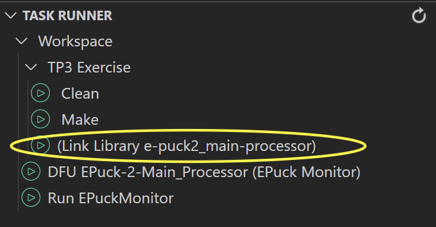
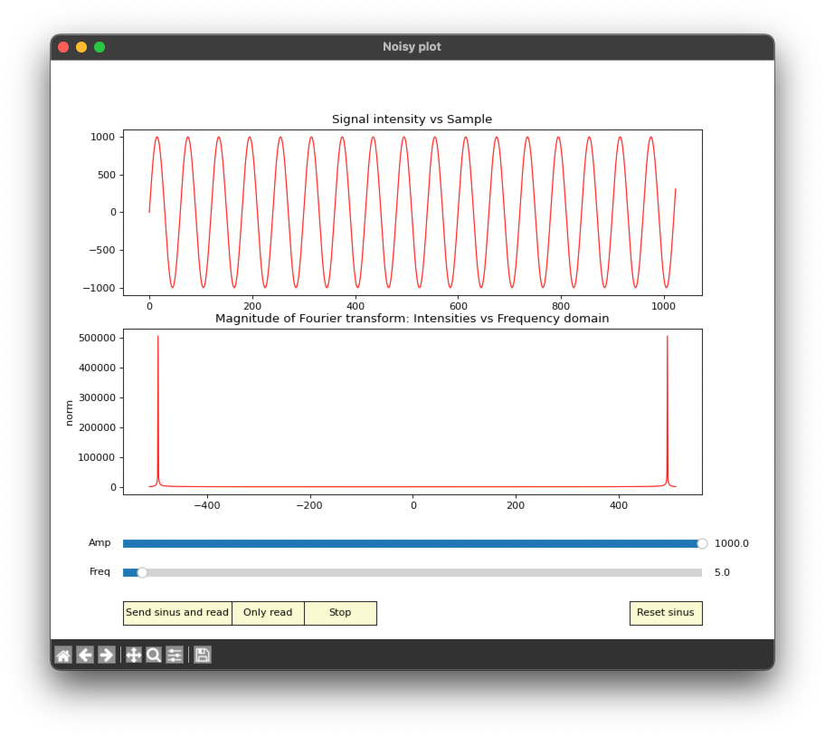

# Introduction
- `Goal`: Controlling the e-puck2 by detecting sound frequencies with the microphones and FFT
- `⏱ Duration`: 4 hours
- `Equipment`: EPuck2 robot, ChibiOS library, Python

# Main goal
- The goal of this practical session is to implement a simple sound remote to control the movements of the robot by detecting the frequency of the sound received by one microphone
- As you are learning during your courses, the Fourier Transform is a very important tool in signal processing
- There are many applications using it, as for example processing a measure, image, sound, etc
- You will apply a Fourier Transform on the signal received from the four microphones of the e-puck2
- To do so, and in a reasonable time, you will apply an algorithm derived from the Cooley and Tuckey algorithm (one of the most used algorithm to perform an FFT), more information about it on Wikipedia : http://en.wikipedia.org/wiki/Cooley-Tukey_FFT_algorithm
- This practical will be divided in two parts :
    1) The first one is to experiment the FFT algorithm with a signal generated by the Python script **plotFFT.py** where you can change the frequency and the amplitude of the signal
        - The goal will be to understand what is done by the FFT and what represents the output you get
        - Two different implementations of the FFT will be used:
            - one from the DSP library of ARM which provides very optimized functions written in C
            - one written in C using no optimization at all
    2) The second part of the practical session is to use the FFT on the sound received by the microphones and to write a little application to control the robot with sounds

# Methodology
- To achieve the main goal, you will go through the following steps:
    - Experimenting the FFT functions with the signal generated by the computer and measuring their execution time
    - Understanding how the sound acquisition works, what are the values received and what are the limitations
    - Using the FFT with real sounds received by the microphones and sending them to the computer to visualize them
    - Coding a simple frequency detection function in order to control the robot with chosen frequencies

## ⚠ ToDo before starting the Lab
- To pull the TP5_Exercise branch, please refer to this [wiki page on fetching exercises and solutions](https://github.com/EPFL-MICRO-315/TPs-Student/wiki/Git-Fetching-Exercises-Solutions)
- Don't forget to push this branch with the upstream enabled to your origin remote
- Once on the branch `TP5_Exercise`, link the `e-puck2_main-processor` library by running the task `Link Library e-puck2_main-processor`
    <p float="left">
        
    </p>

## Files in the project
- **fft.*** Files containing the functions to performs FFT
- **communication.*** Files containing the functions to communicate with the computer for this TP
- **audio_processing.*** Files containing the function to fill to perform the FFT with real sound

# Experimentation part
## Python script
- This first part uses the python script **plotFFT.py** to generate a sinusoidal signal which is sent to the e-puck2
- Then the robot computes the FFT and sends the result to the script, which plots it
- A simple interface is provided to change the frequency, send the signal and receive the result
- The interface you will get is shown in the [Figure 1](#figure-1)
    - On the top, you have a plot of the signal generated
    - Below, you have a plot of the result received from the robot (if any)
    - On the bottom, two sliders to change the frequency and the amplitude of the signal
>### Figure 1
>Python script interface you get when launching **plotFFT.py**
    <p float="left">
    
    </p>

## Sending a signal to the robot
> `Task 1`
>- Compile the code given and use the python script to connect to the serial port used by the e-puck2 to receive and send the data and try to send signals with different frequencies
>- You can observe two peaks
>   - What are they representing ?
>   - Why the zero of the plot is on the center ?
>- What is the max frequency the FFT done by the robot can find with this signal ?
>- 💡 Hint: the script emulates a sampling frequency of 300Hz
>- 💡 Hint: In other words, what is the relation between the frequency the FFT can extract and the sampling frequency of the signal ? (See Shannon / Nyquist)

> `Task 2`
>- With the previous answers, find the relation between the positions of the peaks and the real frequency
>- For example if two peaks are on the positions -200 and 200, what is their frequency
>- **Bonus** : The Fourier Transform of a sinus is a Dirac
>   - Why do you almost never observe a perfect Dirac ?
>   - 💡 Hint: what is the hypothesis made when calculating the DFT and therefore the FFT ?
>   - 💡 Hint: what is the difference between the signal f = 4.5 Hz and f = 4.7 Hz ?
>   - You can resize the window if you can't obtain these values with the sliders

## Code inside the e-puck2
- Now you are going to see in more details the code used to compute the FFT in the e-puck2. 

> `Task 3`
>- Look at the main function to see how it works, understand how the FFT function is used and how the data are received and sent
>- What does **\#ifdef**, **\#else** or **\#endif** mean in the code
>- What is the difference when using them instead of doing a normal **if...else...** condition ?
>- What is the size of the different buffers used and how are arranged the data inside them ?
>- Where are they declared ?
>- What is the goal of the function **arm_cmplx_mag_f32()**

> `Task 4`
>- Now look at the file **fft.c**, you will find two different implementations of an FFT: **doFFT_optimized()** and **doFFT_c()**
>- For both implementations, where are stored the results of the FFT ?
>- 💡 Hint: What does "In-Place" mean ?
>- Use the non optimized function instead of the optimized one to compute the FFT (comment the use of the optimized one in the main function)
>- You will need to convert the data in order to have the structure needed by the function **doFFT_c()** because you have to give a **complex_float** structure array as argument and you have an array containing float numbers
>- ⚠ **WARNING:** the array you will probably declare in order to store the converted values need to be declared as **static** if you declare it inside the function, otherwise you will have a stack overflow of the main thread, which is very difficult to debug
>- Test it with the python script, is the result of the FFT the same ?

> `Task 5`
>- Measure the execution time of the two implementations of the FFT and of the function **arm_cmplx_mag_f32()**
>- For this, you can use the timer12, like in the TP2
>- You can find in the listing [Code block 1](#code-block-1) a reminder of how to use a timer to measure time
>- How many processor cycles represent the times measured ?
>- Is it worth it to use an optimized FFT function ?
>- **Bonus** : You can take a look at the document **[DSP Concepts](#dsp-concepts)** if you want to understand how it is possible to improve the execution time of a code written in C

>### Code block 1
>Example of time measurement using timer 12 and chprintf on the USB port
> ```c
>volatile uint16_t time = 0;
>
>chSysLock();
>//reset the timer counter
>GPTD12.tim->CNT = 0;
>
>//-> Functions to measure <-//
>
>time = GPTD12.tim->CNT;
>chSysUnlock();
>
>chprintf((BaseSequentialStream *)&SDU1, "time=%dus\n", time);
>```

# Programming part
- Now you will use the microphones as source for the FFT and create a little function to control the motors with different frequencies

## Microphones and code
- There are 4 digital microphones present on the e-puck2, they modulate the sound received into a digital signal
- Then the microcontroller needs to demodulate these signals in order to obtain analog signals ([**PDM to PCM filter**](#pdm-to-pcm-filter))
- During the demodulation process, a Low Pass Filter and a High Pass Filter are applied
- The Low Pass Filter is very useful to removes the DC offset of the signal (the analog signal obtained after the demodulation will oscillate around 0 instead of having an offset)
- This means you also remove the low frequencies from the result of the FFT, which could easily have the highest frequency peaks on the FFT's result
- In the **main** function, you can see the function **mic_start(\&processAudioData)**
    - It initializes the interfaces used to sample the microphones and the thread used to demodulate the signals
    - **\&processAudioData** is the address of the function you will fill in order to compute the FFT with sound from the microphones
    - The function given as argument to **mic_start()** is called when a group of samples has been demodulated
    - **processAudioData** receives a buffer containing the samples for the 4 microphones and the number of total samples contained in it
- The microphones are sampled at **16kHz** and the demodulation takes place every 10ms of samples, thus, after one demodulation process, you will obtain **160** samples per microphone
- The file **audio_processing.c** contains one input buffer and one output buffer for each microphone
- You need to put the data coming from the microphones in the input buffers
- The output buffers are for the result of the function used to compute the magnitude

> `Task 6`
>- Uncomment **\#define SEND_FROM_MIC** on top of the **main.c** file, it will let us use the microphones to compute the FFT instead of waiting data from the computer
>- Then fill the function **processAudioData()** in order to fill the 4 input buffers with **1024** (**FFT_SIZE**) samples
>   - ⚠ Pay attention on the description of the function in order to know how to interpret the data in the buffer received by the function
>   - You need to collect samples from the 4 microphones
>- Once the buffers filled with the correct amount of data, proceed the same way it is done in the main function is order to compute the FFT and the magnitude for each microphone
>- Finally, send to the computer the result (only one over ten to not flood the script) of the microphone of your choice in order to visualize it
>   - For this, you need to use **chBSemSignal(\&sendToComputer_sem);**
>   - It will tell the main thread to send the data
>   -You do this because the sending takes a lot of time and if it was done in the **processAudioData** callback, the timing for the demodulation of the microphones would be broken and thus the results too
>- Note: you can uncomment the **DOUBLE_BUFFERING** defined on the top of the main file
>   - This will stop to copy the buffer to send to a temporary buffer
>   - It will let you visualize why double buffering is necessary when a function takes too much time to complete compared to the one that fill the buffer

> `Task 7`
>- Create a function that detects the highest peak of frequency and which executes a motor command depending on the frequency
>- For example if you are in a certain window of frequency, then go forward, if you have another value, go backward, etc
>- Implement as many commands as you want and call this function in the function **processAudioData()**
>- Even if you compute the FFT for the 4 microphones, you can use only one for your function
>- 💡 Hint: It will work if you whistle well but with the noise in the rooms, you'd better install an app on your smartphone to generate the frequency on your phone's speakers (put it close to the microphone used by your code)
>- 💡 Hint: Use **chprintf()** to test your function
>- 💡 Hint: Control the motors with **left_motor_set_speed(speed)** and **right_motor_set_speed(speed)**, the max speed is 2200 steps/s

# Bibliography

### DSP Concepts
- [Example of C optimization with DPS functions](https://www.arm.com/files/pdf/DSPConceptsM4Presentation.pdf)

### PDM to PCM filter
- [PDM audio software decoding on STM32 microcontrollers](http://www.st.com/content/ccc/resource/technical/document/application_note/ca/18/be/bb/f8/53/47/a5/DM00040808.pdf/files/DM00040808.pdf/jcr:content/translations/en.DM00040808.pdf)